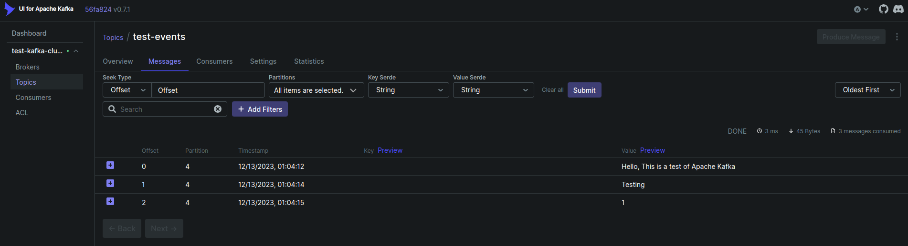

# Introduction to Kafka

> **_NOTE:_**  You must grant read/write/execute permissions to the "data" directory for the user running the docker-compose script - assuming you are non-root which should always be best practice.
>
> If permissions are wrong you will see the error: Command [/usr/local/bin/dub path /var/lib/kafka/data writable] FAILED !

Apache Kafka® is a distributed event streaming platform that is used for building real-time data pipelines and streaming applications. Kafka is designed to handle large volumes of data in a scalable and fault-tolerant manner, making it ideal for use cases such as real-time analytics, data ingestion, and event-driven architectures.

At its core, Kafka is a distributed publish-subscribe messaging system. Data is written to Kafka topics by producers and consumed from those topics by consumers. Kafka topics can be partitioned, enabling the parallel processing of data, and topics can be replicated across multiple brokers for fault tolerance.

With Kafka you get command-line tools for management and administration tasks, and Java and Scala APIs to build an event streaming solution for your scenarios.

### Screenshot

